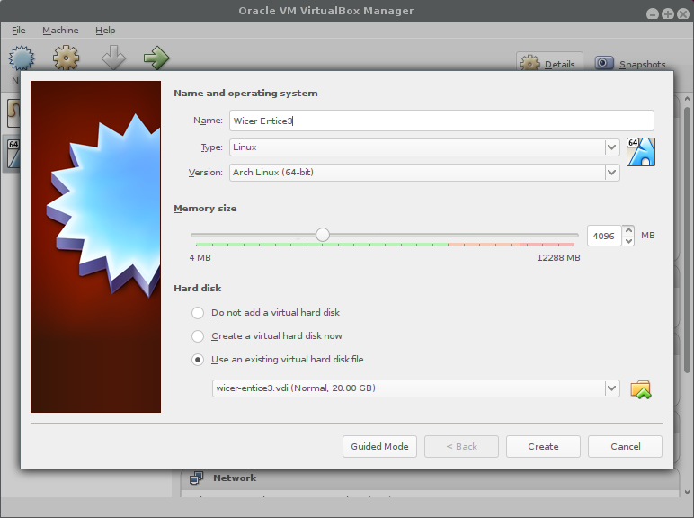
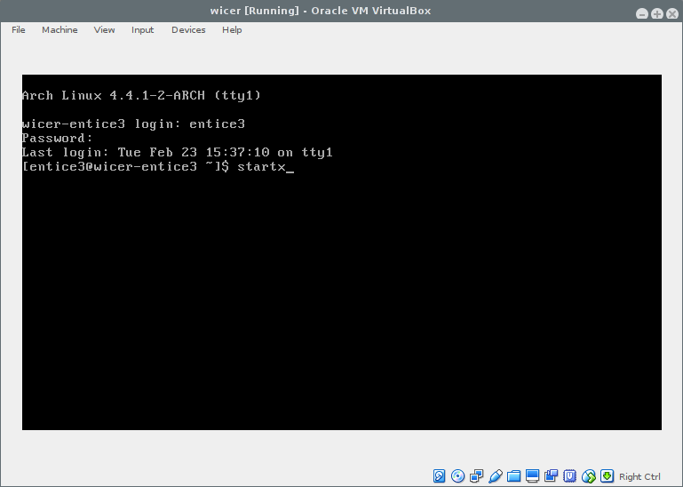
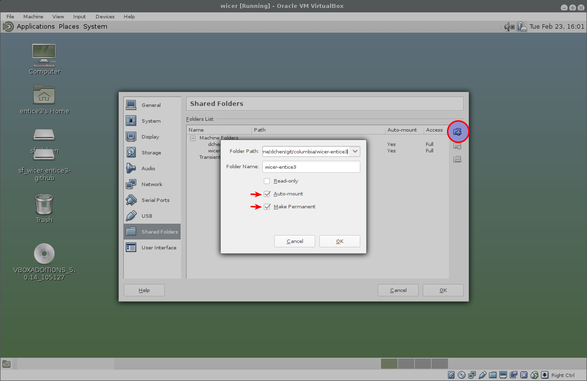

# Setting up the Arch Linux Virtual Machine

## Setting up the VirtualBox VM

1. Open up VirtualBox
2. Machine > New
   1. Click Expert Mode on the bottom
   2. Name: Wicer-Entice3
   3. Type: Linux
   4. Version: Arch Linux (64-bit)
   5. Memory Size: 4096 (you can use the slider or enter the value in the textbox)
   6. Hard disk > use an existing virtual hard disk file
	  1. select the `wicer-entice3.vdi` file

## Launching the Virtual Machine Part 1

1. Select the `Wicer-Entice3` virtual machine(or whatever you named it above)
2. Click the green `Start` arrow

## First time VM Setup

You should know if you need to peform this step.

If someone you are working with has already performed these steps, then skip to the next section.

1. Reset password
   1. When you see `wicer-entice3 login:` type in `daniel` for the username
   2. Password: `daniel`
   3. `sudo su`
   4. `passwd entice3`
   5. pick a new password, suggest to use `entice3`
2. Add user to admin group
   1. `usermod -a -G root entice3`
   2. `usermod -a -G vboxsf entice3`
3. Log in as new user:
   1. `exit`
   2. `exit`
   3. You should see the original prompt to log in again.
   4. Continue with below steps

## Launching the Virtual Machine Part 2

1. When you see `wicer-entice3 login:` type in `entice3` for the username
2. Password: `entice3` (or whatever was set under the `First Time VM Setup`)
   - Note: when typing the password there will be no symbols printed to the screen, it will appear that you are not typing anyhting.  Hit your `enter` key when you have finished typing the password.
3. You will end with with a promt: `[entice3@wicer-entice3 ~]$`
4. type `startx` to launch the desktop

## Setup for new users

1. Allow copy paste function between your computer and the virtual machine
   - Devices > Shared Clipboard > bidirectional
   - Devices > Drag and Drop > bidirectional
2. Mount folder with `EnTice3` data
   - Devices > Shared Folders > Shared Folders Settings...
   - 
   - Click the folder with the `+` arrow on it
   - Folder Path:
	 - click the drop down and select `other`
	 - navigate to a directory where you can get to both the data and the output directory
	 - check off the `Auto-mount` and `Make Permanent` checkboxes.
3. Restart the machine
   1. System > Shut Down ... > Restart
4. When you login again there should be a drive mounted on your desktop
   - You should be able to double click and open this drive
   - The contents of this drive should be exactly the folder you 'shared' above
   - Note: this is a direct link to your specified drive, any changes made here, either from the VM or
	 your computer, will be reflected.

## Getting the Wicer EnTICE3 code

If you know how to use git, you can clone the repository down.
Otherwise follow the directions below.

1. navigate to [https://github.com/chendaniely/wicer-entice3](https://github.com/chendaniely/wicer-entice3)
2. Download the zip version of the repository by clicking the `Download Zip` link
3. Save the `master.zip`
   1. If you use your regular desktop save it into the same directory as your 'shared' directory
   2. If you use the browser in the VM, you can save it on the `Desktop`
4.Unzip the `master.zip` into the Desktop
5. Repeat steps as needed for new updates.
   - You should be able to delete the zip and the unziped folder since the main data is on the shared drive
